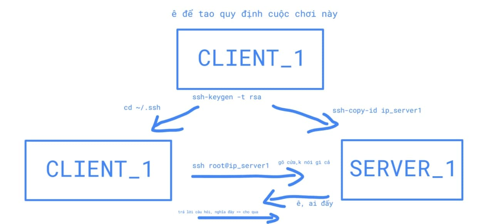
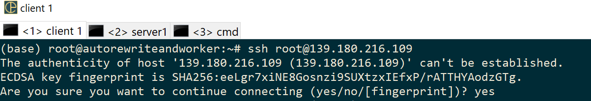

# how-to-config-ssh-client-and-server
how to config ssh client and server (use conemu in windows)

### there are 2 (and more server) entity join the this game: client_1 and server1, server2 ...




<br/>
<br/>





in client_1
```
ssh-keygen -t rsa
cd ~/.ssh
```

copy public key to server_1
```
ssh-copy-id ip_server_1
```

in client_1 type the followding command to login server
```
ssh-copy-id ip_server_1
```

config ssh in server to use password authen and key base authen
```
vi /etc/ssh/sshd_config
PubkeyAuthentication yes
PasswordAuthentication yes
ChallengeResponseAuthentication no
```
config ssh in server to disable password authen
```
vi /etc/ssh/sshd_config
PubkeyAuthentication yes
PasswordAuthentication no
ChallengeResponseAuthentication no
```
